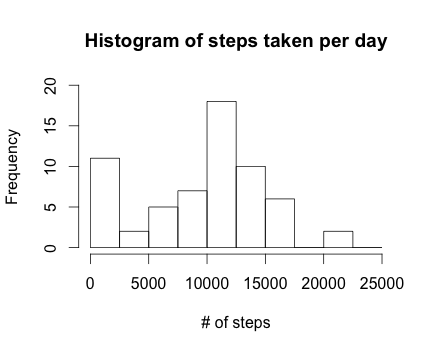
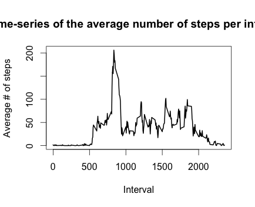
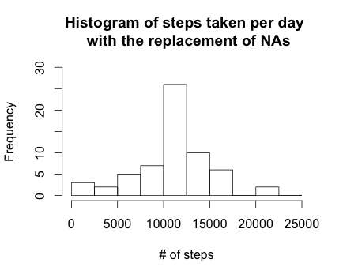
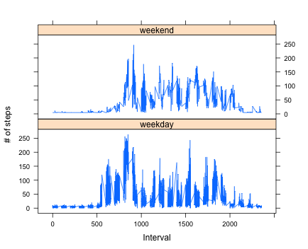

## Loading and preprocessing the data

```{r, results = 'asis', echo = TRUE}
# Clear the workspace
rm( list = ls() )

# Load the data 
data_raw <- read.csv("data/activity.csv", stringsAsFactors = FALSE)

# Process the data
# Data format: YYYY-MM-DD
data_raw$date <- as.POSIXct(data_raw$date, format = "%Y-%m-%d")
data <- data.frame(date = data_raw$date, 
                   interval = data_raw$interval, 
                   steps = data_raw$steps)

```

## What is mean total number of steps taken per day?

```{r, results = 'asis', echo = TRUE}
# Calculate the total number of steps taken per day
sum_data <- aggregate(data$steps, by = list(data$date), 
                      FUN = sum, na.rm = TRUE)

names(sum_data) <- c("date", "steps")

#  Make a histogram
hist(sum_data$steps, 
     breaks = seq(from=0, to=25000, by=2500),
     xlab = "# of steps", 
     ylab = "Frequency",
     ylim = c(0, 20),
     main = "Histogram of steps taken per day")
```



```{r, results = 'asis', echo = TRUE}
# Calculate the mean and median
mean <- as.integer(mean(sum_data$steps))
median <- median(sum_data$steps)
```
The mean and median of the total number of steps taken per day are `r mean`(9354) and `r median`(10395).


## What is the average daily activity pattern?

```{r, results = 'asis', echo = TRUE}
# Make a time series plot of the 5-minute interval (x-axis) and the average number of steps taken, averaged across all days (y-axis)
mean_data <- aggregate(data$steps, by = list(data$interval), 
                       FUN = mean, na.rm = TRUE)
names(mean_data) <- c("interval", "mean")

# Compute the time series plot
plot(mean_data$interval, mean_data$mean, 
     type = "l", lwd=2, 
     xlab="Interval", 
     ylab="Average # of steps", 
     main="Time-series of the average number of steps per intervals")
```



```{r, results = 'asis', echo = TRUE}
# Find the interval, which contains the maximum number of steps.
max <- mean_data[which(mean_data$mean == max(mean_data$mean)), 1]
```

The 5-minute interval, on average across all the days in the dataset, contains the maximum number of steps is `r max`(835).


## Imputing missing values

```{r, results = 'asis', echo = TRUE}
# Calculate the total number of missing values in the dataset 
na_pos <- which(is.na(data$steps))
NA_num <- length(na_pos)
```

The total number of missing values in the dataset is `r NA_num`.

```{r, results = 'asis', echo = TRUE}
# Usee the mean for filling in all of the missing values in the dataset.
mean_vec <- rep(mean(data$steps, na.rm = TRUE), 
                times = NA_num)
                               
data_0na <- data
data_0na[na_pos, "steps"] <- mean_vec

```

```{r, results = 'asis', echo = TRUE}
# The following steps are based on the new dataset with the replacement of NAs.

# Calculate the total number of steps taken per day
sum_data_0na <- aggregate(data_0na$steps, by = list(data_0na$date), 
                      FUN = sum, na.rm = TRUE)

names(sum_data_0na) <- c("data", "steps")

#  Make a histogram
hist(sum_data_0na$steps, 
     breaks = seq(from=0, to=25000, by=2500),
     xlab = "# of steps", 
     ylab = "Frequency",
     ylim = c(0, 30),
     main = "Histogram of steps taken per day \n with the replacement of NAs")
```



```{r, results = 'asis', echo = TRUE}
# Calculate the mean and median
mean_0na <- as.integer(mean(sum_data_0na$steps))
median_0na <- as.integer(median(sum_data_0na$steps))
```

The mean and median of the total number of steps taken per day are `r mean_0na`(10766) and `r median_0na`(10766).

These values differ from in the first part.
The missing data is a huge number of data, which contributes a bigger mean and median value.

## Are there differences in activity patterns between weekdays and weekends?

```{r, results = 'asis', echo = TRUE}
# Load the lattice library
library(lattice)

# Create a new factor variable in the dataset with two levels 
# – “weekday” and “weekend” indicating whether a given date is a weekday or weekend day.
data_daytype <- cbind(data_0na, weekday = tolower(weekdays(data_0na$date)))                  
data_daytype <- cbind(data_daytype, 
                      daytype = ifelse(data_daytype$weekday == "saturday" | 
                                       data_daytype$weekday == "sunday",
                                "weekend", 
                                "weekday"))  

# Compute the average number of steps taken, averaged across all daytype variable
mean_data_daytype <- aggregate(data_daytype$steps, 
                               by = list(data_daytype$daytype, 
                                         data_daytype$weekday, data_daytype$interval), mean)
names(mean_data_daytype) <- c("daytype", "weekday", "interval", "mean")

# Compute the time serie plot
xyplot(mean ~ interval | daytype, mean_data_daytype, 
       type = "l", 
       xlab = "Interval", 
       ylab = "# of steps", 
       layout = c(1,2))
```



