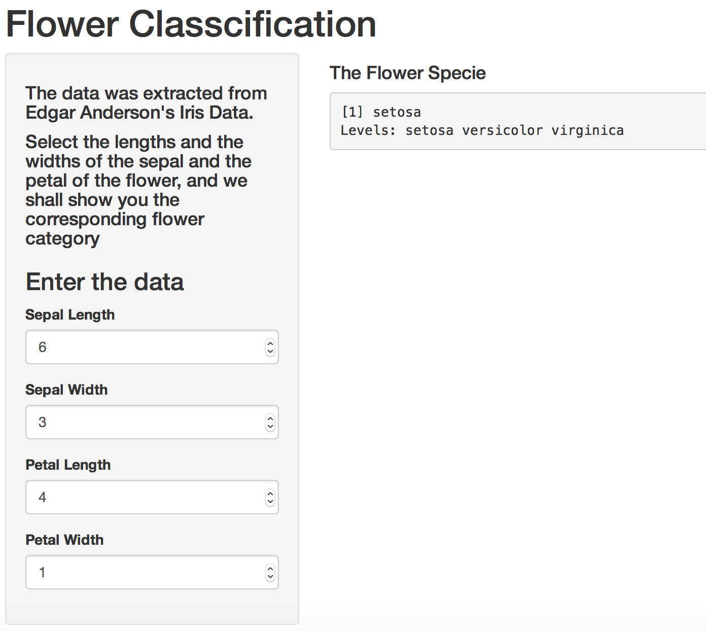

Flower Classification
========================================================

author: Xiangzhu Long


date: 17th May, 2015

Introduction
========================================================

According to the size of the flower, we can classcify it to diffrent category(setosa versicolor virginica).

1.Build the classcifier by **iris** dataser;

2.Make classicfication on the input flower size;


DataSet
========================================================
Here, we implement Edgar Anderson's Iris Data to build the classifier.


```r
data(iris)
summary(iris)
```

```
  Sepal.Length    Sepal.Width     Petal.Length    Petal.Width   
 Min.   :4.300   Min.   :2.000   Min.   :1.000   Min.   :0.100  
 1st Qu.:5.100   1st Qu.:2.800   1st Qu.:1.600   1st Qu.:0.300  
 Median :5.800   Median :3.000   Median :4.350   Median :1.300  
 Mean   :5.843   Mean   :3.057   Mean   :3.758   Mean   :1.199  
 3rd Qu.:6.400   3rd Qu.:3.300   3rd Qu.:5.100   3rd Qu.:1.800  
 Max.   :7.900   Max.   :4.400   Max.   :6.900   Max.   :2.500  
       Species  
 setosa    :50  
 versicolor:50  
 virginica :50  
                
                
                
```


Build Model
========================================================


```r
library(e1071)
classifier <- naiveBayes(iris[,1:4], iris[,5])
```


```

Naive Bayes Classifier for Discrete Predictors

Call:
naiveBayes.default(x = iris[, 1:4], y = iris[, 5])

A-priori probabilities:
iris[, 5]
    setosa versicolor  virginica 
 0.3333333  0.3333333  0.3333333 

Conditional probabilities:
            Sepal.Length
iris[, 5]     [,1]      [,2]
  setosa     5.006 0.3524897
  versicolor 5.936 0.5161711
  virginica  6.588 0.6358796

            Sepal.Width
iris[, 5]     [,1]      [,2]
  setosa     3.428 0.3790644
  versicolor 2.770 0.3137983
  virginica  2.974 0.3224966

            Petal.Length
iris[, 5]     [,1]      [,2]
  setosa     1.462 0.1736640
  versicolor 4.260 0.4699110
  virginica  5.552 0.5518947

            Petal.Width
iris[, 5]     [,1]      [,2]
  setosa     0.246 0.1053856
  versicolor 1.326 0.1977527
  virginica  2.026 0.2746501
```


Shiny
========================================================



